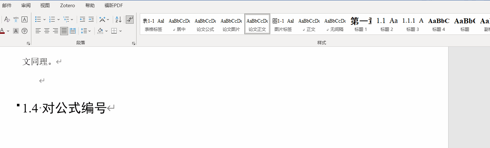
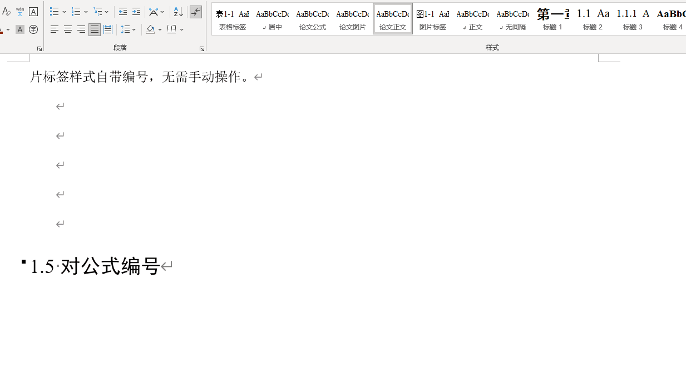
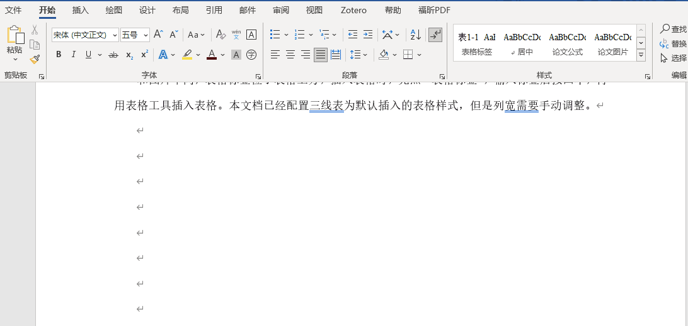
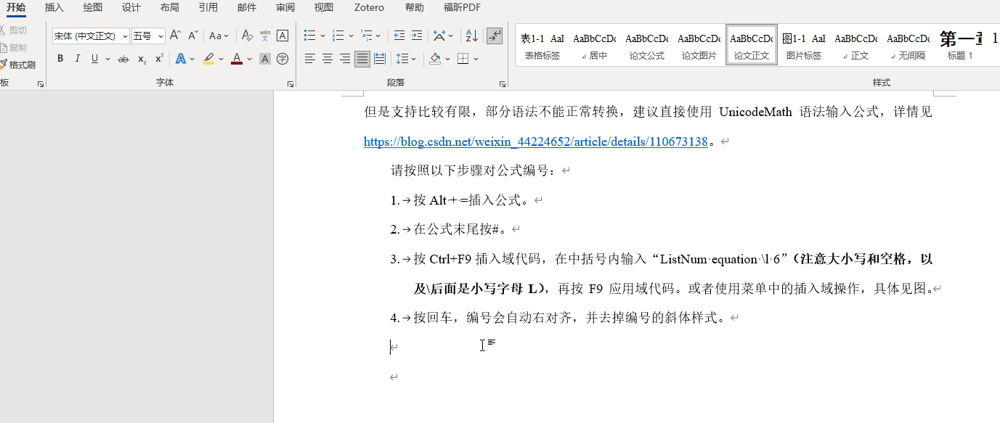
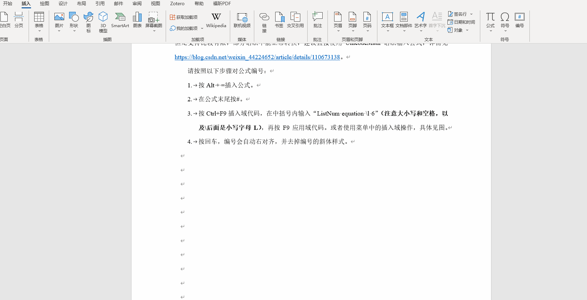
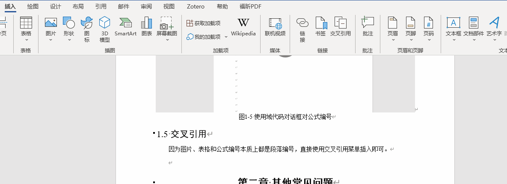
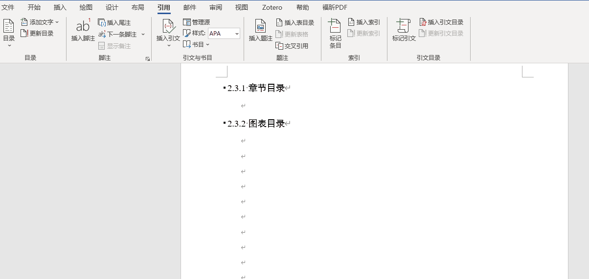
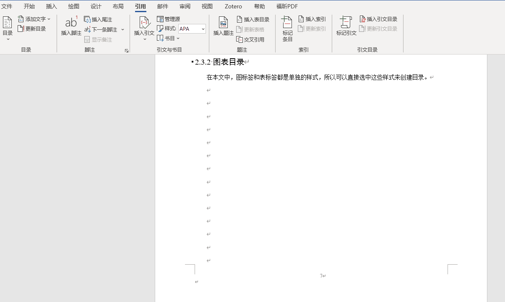

# SEUThesis-Word: 东南大学硕士学位论文Word模板 Southeast University Master's Thesis Word Template

内网用户也可以直接在SEU GitLab访问[此项目](https://gitlab.seu.edu.cn/220232291/seuthesis-word)。

## 项目简介

这是一个基于Word样式和自动编号的东南大学硕士学位论文模板，
旨在帮助更高效地编写学位论文。模板支持多种自动化格式更新功能，只需要输入内容，并应用相应的格式，文档会自动呈现出符合要求的外观。

项目的文档网站是[https://tompan-1901.github.io/SEUThesis-Word](https://tompan-1901.github.io/SEUThesis-Word)。

文档中的设置参考了视频[word教程 | 你的下一个LaTex何必是LaTex](https://www.bilibili.com/video/BV1se411U7Dy)，也向视频作者表达感谢。

## 特性

该模板提供以下自动化格式支持：

| 特性                     | 支持情况    |
|------------------|-------------------|
| 自动章节编号             | 支持✅     |
| 自动图片编号             | 支持✅     |
| 自动表格编号             | 支持✅     |
| 自动公式编号             | 支持✅     |
| 自动目录更新             | 支持✅     |
| 自动页眉页脚生成         | 支持✅     |

## 使用方法

模板已经配置了下表中的样式，选择即可使用，无需手动调整：

| 样式名       | 说明                                         |
|--------------|----------------------------------------------|
| 标题1        | 一级标题，“第x章”                            |
| 无编号标题   | 用于摘要、致谢、参考文献等不需要编号的标题   |
| 标题2        | 二级标题，x.x                                 |
| 标题3        | 三级标题，x.x.x                               |
| 论文正文     | 正文样式                                     |
| 论文图片     | 图片样式                                     |
| 图片标签     | 图片自动编号样式                             |
| 表格标签     | 表格自动编号样式                             |

### 标题、正文样式

标题样式和正文样式使用非常简单。输入文字后，在Word上方的样式框中选择相应的样式即可应用。

### 使用图片、表格和公式样式

- **图片**：插入图片后按回车，下一段会自动设置为“图片标签”，编号自动生成。

- **表格**：插入表格前先选择“表格标签”样式，输入标签后按回车，再插入表格。

- **公式**：微软Office只支持UnicodeMath公式，虽然Word也支持将$\LaTeX$公式转换为UnicodeMath公式，但是支持有限，部分语法不能正常转换，建议直接使用UnicodeMath语法输入公式，如何输入UnicodeMath请看[这里](https://blog.csdn.net/weixin_44224652/article/details/110673138)。

    请按照以下步骤对公式编号：
    
    1. 按`Alt + =`插入公式。
    2. 在公式末尾按`#`。
    3. 按Ctrl+F9插入域代码。在括号中输入`ListNum equation \l 6`**（注意空格，以及\后面是小写字母L）**或者使用菜单中的插入域操作，具体见图。关于ListNum的具体原理，详见[这里](https://support.microsoft.com/en-us/office/field-codes-listnum-field-557541b1-abb2-4959-a9f2-401639c8ff82)。
    4. 按回车，编号会自动右对齐，并去掉编号的斜体样式。

### 交叉引用

- **图片和表格**

因为图片、表格和公式编号本质上都是段落编号，直接使用交叉引用菜单插入即可。

- **参考文献**

作者推荐使用Zotero/EndNote来管理参考文献，并自动插入引注，请自行查询相关资料。

### 插入目录

一句话，目录可以基于大纲级别和样式创建。本文档中已经预置章节目录、表目录和图目录，也可以根据需要自行增加或删除。

- **章节目录**

一般情况下章节目录只需要展示前三级标题，即大纲级别1、2、3。自定义目录中的设置刚好满足要求。

- **图表目录**

在自定义目录选项中，设置图片标签/表格标签为一级目录，并去掉其他的样式，即可显示图片和表格目录。

## 其他注意事项

- 本文中的gif动图也同时插入在模板中，看不清可以直接看模板里的说明。动图中部分字体字号和《东南大学研究生学位论文格式规定》不一致，但是模板文档已经按照规定进行修改，请以文档内格式为准。

- 本模板使用Microsoft Office 2021 LTSC版本制作，为了确保最好的显示效果，强烈建议全程使用Office编辑。东南大学师生可以在内网下载正版Office软件，登录[正版软件管理与服务平台](https://software.seu.edu.cn/)后按提示操作。