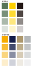
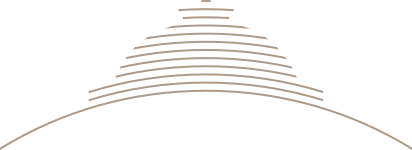
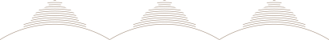

# 东南大学视觉识别系统

## 简介

这一页提供了由东南大学官网提供的视觉识别规范pdf导出的相关素材，包括校标、校名标准字、校标校名组合、标准色、校训字体、象征图形。点击“下载svg”按钮即可下载对应的svg文件。

因为pdf中的矢量图本身大小不同，所以页面上的svg实际大小也不一样，如果需要统一大小，可以使用[Inkscape](https://inkscape.org/)等矢量图编辑软件打开后进行调整。

色卡中的颜色是根据pdf中给出的rgba值，混合白色后得到的rgb颜色，鼠标悬浮在色块上即可复制颜色。

您可以将这一页的素材用于汇报ppt中，或者其他需要东南大学视觉识别系统素材的场合。请注意，这些素材是由[东南大学视觉识别系统](https://www.seu.edu.cn/bsxtwxw/main.htm)提供的，请尊重原作者版权，在合适的场合使用。

## 校标

  

    
    
彩色校标

    <button @click="handleDownload">下载svg</button>
  

  

    
    
黑白校标

    <button @click="handleDownload">下载svg</button>
  

## 标准字

  

    
    
标准字横排

    <button @click="handleDownload">下载svg</button>
  

  

    
    
英文标准字横排

    <button @click="handleDownload">下载svg</button>
  

  

    

      
      

        悬浮鼠标查看完整效果
      

    

    
标准字竖式

    <button @click="handleDownload">下载svg</button>
  

## 校标、标准字组合

  

    
    
彩色校标中英文字组合

    <button @click="handleDownload">下载svg</button>
  

  

    
    
黑白校标中英文字组合

    <button @click="handleDownload">下载svg</button>
  

  

    
    
彩色校标中文组合

    <button @click="handleDownload">下载svg</button>
  

  

    
    
黑白校标中文组合

    <button @click="handleDownload">下载svg</button>
  

  

    
    
彩色校标中英文字组合-上下

    <button @click="handleDownload">下载svg</button>
  

  

    
    
黑白校标中英文字组合-上下

    <button @click="handleDownload">下载svg</button>
  

  

    
    
彩色校标中文组合-上下

    <button @click="handleDownload">下载svg</button>
  

  

    
    
黑白校标中文组合-上下

    <button @click="handleDownload">下载svg</button>
  

  

    

      
      

        悬浮鼠标查看完整效果
      

    

    
彩色校标中英文字组合-竖式

    <button @click="handleDownload">下载svg</button>
  

  

    

      
      

        悬浮鼠标查看完整效果
      

    

    
黑白校标中英文字组合-竖式

    <button @click="handleDownload">下载svg</button>
  

  

    

      
      

        悬浮鼠标查看完整效果
      

    

    
彩色校标中文组合

    <button @click="handleDownload">下载svg</button>
  

  

    

      
      

        悬浮鼠标查看完整效果
      

    

    
黑白校标中文组合

    <button @click="handleDownload">下载svg</button>
  

## 标准色和标准辅助色

### 绿色

  

    

      

        {{rgba2rgb(targetColor)}}
      

      

        {{rgb2hex(rgba2rgb(targetColor))}}
      

    

  

### 黄色

  

    

      

        {{rgba2rgb(targetColor)}}
      

      

        {{rgb2hex(rgba2rgb(targetColor))}}
      

    

  

### 黑色

  

    

      

        {{rgba2rgb(targetColor)}}
      

      

        {{rgb2hex(rgba2rgb(targetColor))}}
      

    

  

### 辅助色1

  

    

      

        {{rgba2rgb(targetColor)}}
      

      

        {{rgb2hex(rgba2rgb(targetColor))}}
      

    

  

### 辅助色2

  

    

      

        {{rgba2rgb(targetColor)}}
      

      

        {{rgb2hex(rgba2rgb(targetColor))}}
      

    

  

### 金色

  

    

      

        {{rgba2rgb(targetColor)}}
      

      

        {{rgb2hex(rgba2rgb(targetColor))}}
      

    

  

### 银色

  

    

      

        {{rgba2rgb(targetColor)}}
      

      

        {{rgb2hex(rgba2rgb(targetColor))}}
      

    

  

  

    

      
      

        悬浮鼠标查看完整效果
      

    

    
标准色卡（可以放到ppt里方便取色）

    <button @click="handleDownload">下载svg</button>
  

## 校训字体

  

    
    
校训标准字横排

    <button @click="handleDownload">下载svg</button>
  

  

    

      
      

        悬浮鼠标查看完整效果
      

    

    
校训标准字竖式

    <button @click="handleDownload">下载svg</button>
  

## 象征图形

  

    
    
大礼堂-独立

    <button @click="handleDownload">下载svg</button>
  

  

    
    
大礼堂-连续

    <button @click="handleDownload">下载svg</button>
  

  

    
    
大礼堂-辅助-独立

    <button @click="handleDownload">下载svg</button>
  

  

    
    
大礼堂-辅助-连续

    <button @click="handleDownload">下载svg</button>
  

  

    
    
大礼堂-剪影-横向

    <button @click="handleDownload">下载svg</button>
  

  

    

      
      

        悬浮鼠标查看完整效果
      

    

    
大礼堂-剪影-纵向

    <button @click="handleDownload">下载svg</button>
  

  

    

      
      

        悬浮鼠标查看完整效果
      

    

    
六朝松

    <button @click="handleDownload">下载svg</button>
  

